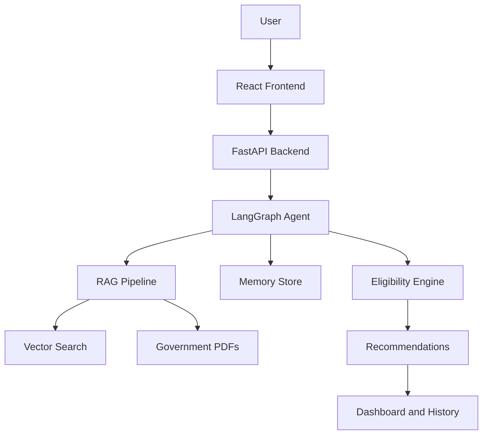

# Hackkkkk the Matrix

An AI-powered government scheme assistant designed as a startup-ready SaaS platform. The system combines a React frontend, a FastAPI backend, a LangGraph agent workflow, semantic retrieval over scheme documents, and persistent user memory to explain eligibility, recommend schemes, and generate action checklists.

## Project Overview

This project is built for a hackathon demo, but the structure is intentionally production-oriented: clear separation of frontend and backend, documented APIs, agent workflow design, security considerations, and demo-ready data flows.

## Problem Statement

Citizens often struggle to discover relevant government schemes, understand eligibility, and complete the application steps. The information is fragmented across PDFs, portals, and state-specific sources, which makes discovery slow and confusing.

## Solution

The platform provides a conversational assistant that collects user context, retrieves relevant scheme documents, reasons over eligibility, ranks the best options, and produces a clear checklist with memory-aware follow-up conversations.

## Features

- Conversational scheme discovery with memory retention
- Eligibility reasoning with explainable recommendations
- Document ingestion and semantic search for government PDFs
- Citizen dashboard with timeline, bookmarks, notifications, and readiness score
- Admin dashboard for analytics, uploads, and vector store health
- JWT authentication with role-based access control
- Rate limiting, input validation, secure file upload, and audit logging
- Demo personas for farmer, student, woman entrepreneur, senior citizen, and business owner

## Architecture

Detailed diagrams live in [docs/architecture.md](docs/architecture.md).

## Tech Stack

- Frontend: React, Vite, TypeScript
- Backend: FastAPI, Pydantic, Python
- AI Orchestration: LangGraph, Gemini-compatible LLM adapter
- Retrieval: FAISS-compatible vector search, PyMuPDF parsing
- Persistence: PostgreSQL, Redis
- Testing: Pytest, API tests, workflow tests, component tests
- Delivery: Docker-ready folder structure and documentation-first workflow

## Installation

1. Set up the backend Python environment and install dependencies from `backend/requirements.txt`.
2. Install the frontend dependencies from `frontend/package.json`.
3. Configure environment variables using the example files under `backend/config` and the frontend service layer.

## Running Locally

Backend:

1. Start the FastAPI app from the `backend` directory.
2. Expose the API on the configured port for the frontend client.

Frontend:

1. Start the Vite dev server from the `frontend` directory.
2. Point the client to the backend API base URL.

## Folder Structure

The canonical structure is documented in [docs/folder-structure.md](docs/folder-structure.md).

## AI Agent Workflow

The full LangGraph workflow is documented in [docs/architecture.md](docs/architecture.md).

## RAG Pipeline

The document ingestion and retrieval flow is documented in [docs/architecture.md](docs/architecture.md).

## Screenshots

Add product screenshots, dashboard captures, and demo-state images here before the final submission.

## Future Scope

- Multilingual support for regional languages
- Live portal integrations for application status
- Mobile app and WhatsApp channel support
- State-specific policy packs and new dataset sync automation
- Advanced analytics for policy coverage and public impact

## License

Choose a hackathon-friendly open source license before publishing.

## Contributors

- Team Hackkkkk the Matrix
