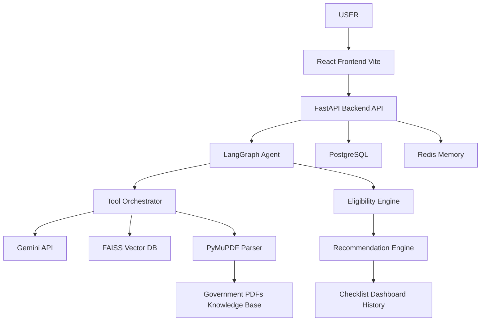
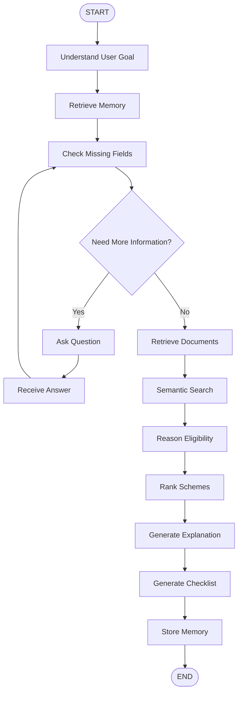
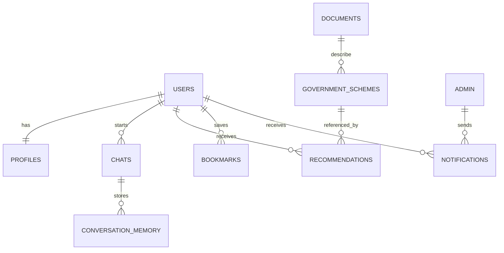
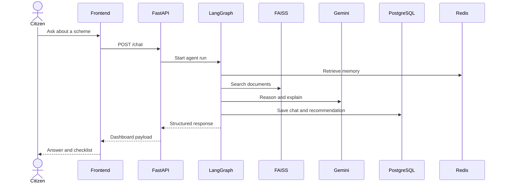
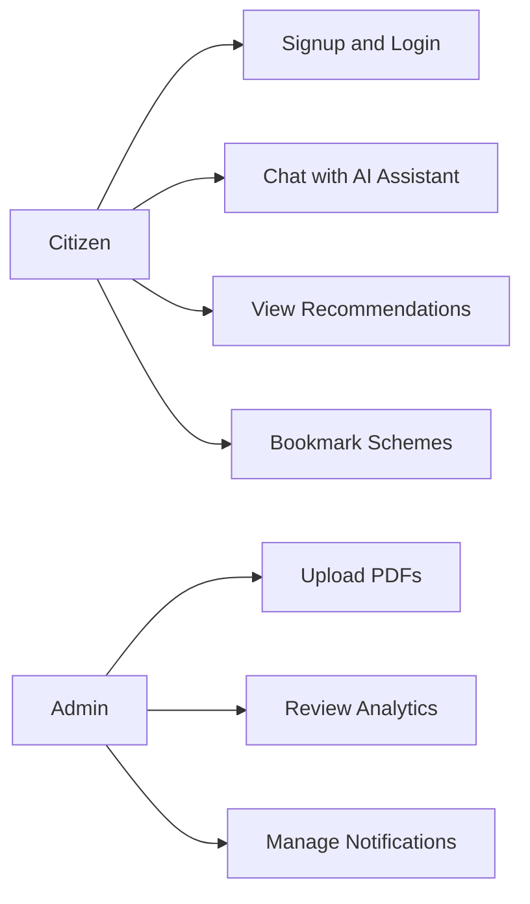
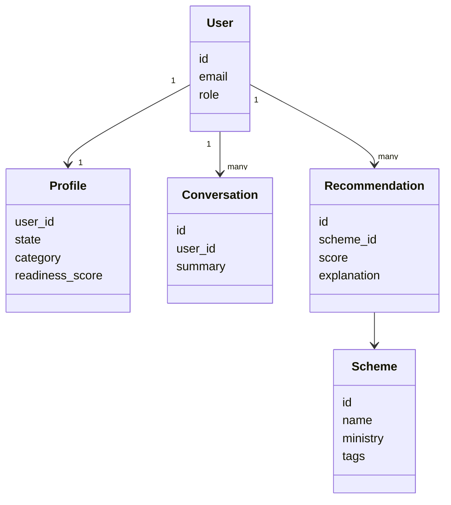
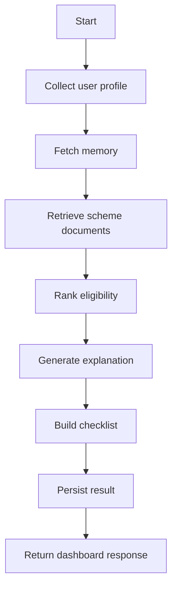

# System Architecture and Workflow

## High-Level Architecture

## LangGraph State Diagram

## ER Diagram

## UML Sequence Diagram

## Use Case Diagram

## Class Diagram

## System Flowchart

